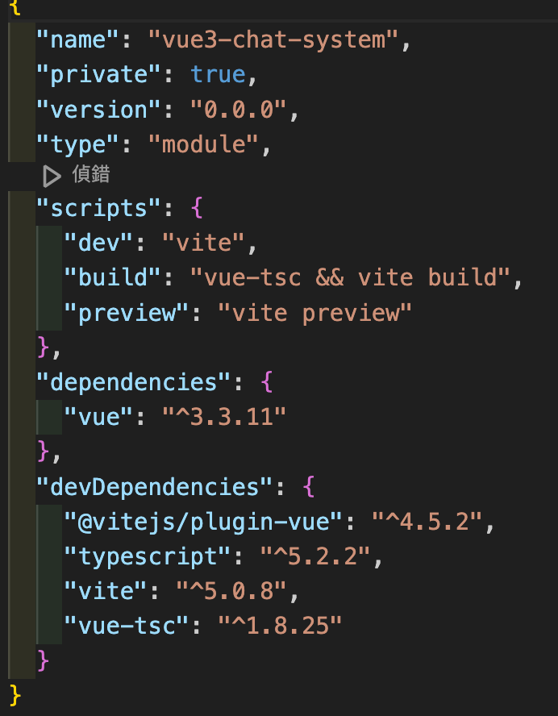

# 0.0.0

## 创建项目

```bash
# https://cn.vitejs.dev/guide/
yarn create vite vue3-chat-system --template vue-ts

# install
- yarn install
- yarn

# run dev
- yarn dev
```


### node_modules
```bash
- @vitejs/plugin-vue # 用于编辑vue文件
- vue-tsc # 专用 vue3项目的 Typescript类型检查工具
```
